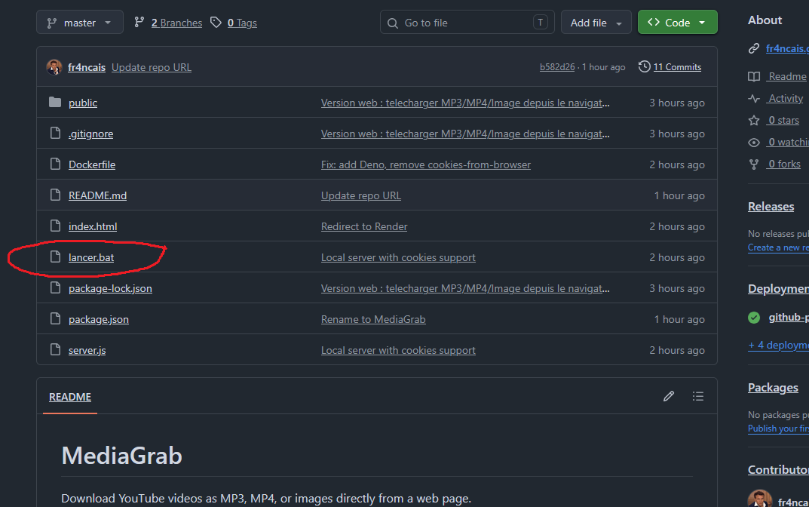
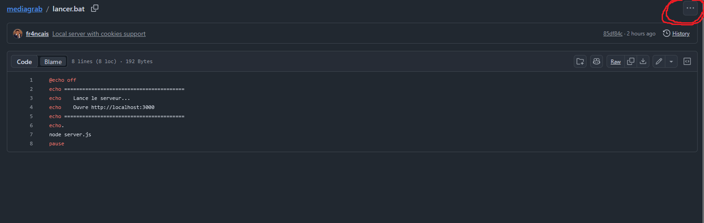
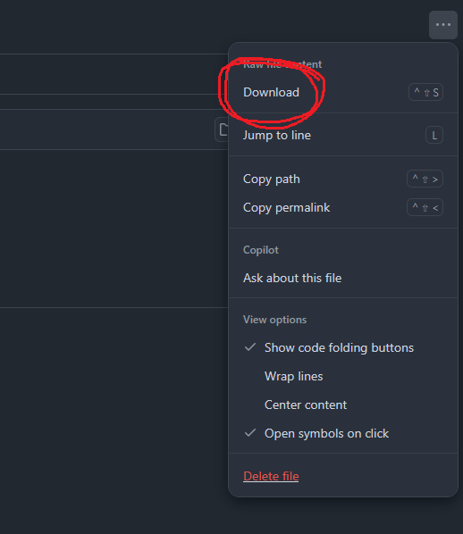
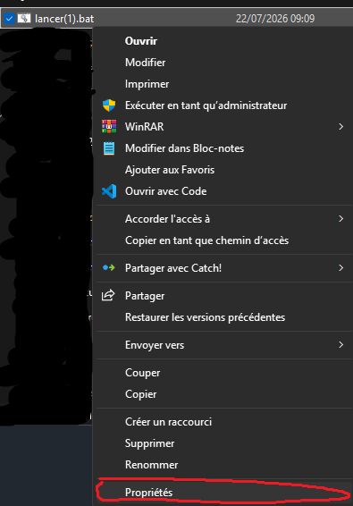
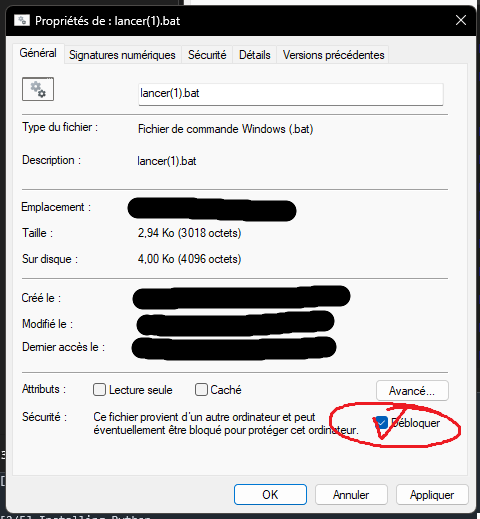
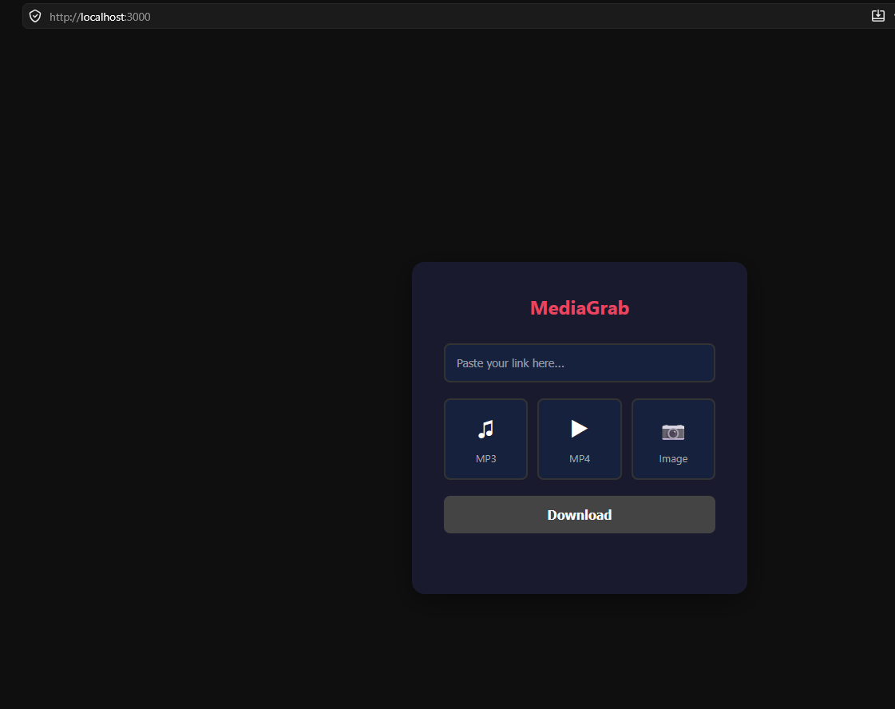

# MediaGrab

Download YouTube videos as MP3, MP4, or images directly from a web page.

## Features

- **MP3** - Download audio from a YouTube video
- **MP4** - Download video in 1080p 60fps
- **Image** - Download an image from a URL

## Quick Start (no install needed)

### Step 1: Go to the GitHub repo



### Step 2: Download lancer.bat

Click on **lancer.bat**, then click the **3 dots** menu (top right) and select **Download**





### Step 3: Unblock the file

Right-click on **lancer.bat** > **Properties** > check **Unblock** > click **OK**





### Step 4: Open the site

Double-click **lancer.bat** to start the server. A terminal window will open. Then go to **http://localhost:3000** in your browser. Paste a YouTube link, choose MP3/MP4/Image and click Download!




---

## Full Installation

### Prerequisites
- [Node.js](https://nodejs.org/) (v18+)
- [Python](https://python.org/) (v3.10+)
- [yt-dlp](https://github.com/yt-dlp/yt-dlp) : `pip install yt-dlp`
- [FFmpeg](https://ffmpeg.org/) : `winget install Gyan.FFmpeg`
- [Deno](https://deno.land/) : `irm https://deno.land/install.ps1 | iex`
- Firefox with a logged-in YouTube account

### Launch

```bash
# Clone the repo
git clone https://github.com/fr4ncais/mediagrab.git
cd mediagrab

# Install dependencies
npm install

# Start the server
node server.js
```

Or double-click `lancer.bat`

Then open **http://localhost:3000** in your browser.

## Tech stack

- **Frontend**: HTML, CSS, JavaScript
- **Backend**: Node.js, Express
- **Download**: yt-dlp, FFmpeg

## Author

Made by **fr4ncais**

GitHub: [https://github.com/fr4ncais](https://github.com/fr4ncais)

## License

Free project for personal use.